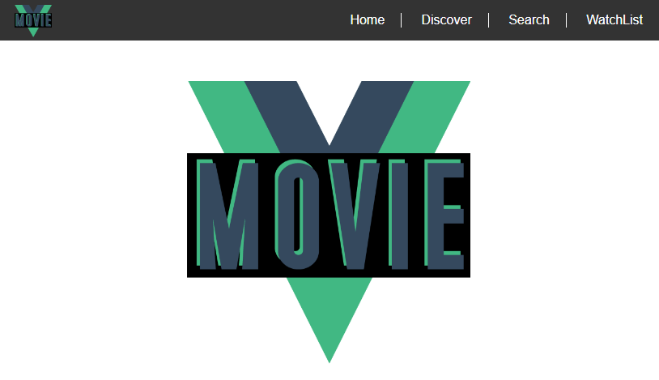

# Movie-Vue

#### GitHub: https://github.com/allenjwelch/movie-vue
#### Heroku: https://movie-vue.herokuapp.com/

## Description:
A Vue.js & Node.js application utilizing The Movie DB API. Upcoming features to include secure sign-in and user account with Watchlist of favorites using SQL database.
Built with the help of tutorials and guides from Scott Tolinski's "Vue.js for Everyone" (https://www.leveluptutorials.com/tutorials/vuejs-for-everyone) & Nick Manning's "Easily deploy a Vue + Webpack App to Heroku in 5 Steps"(https://medium.com/netscape/deploying-a-vue-js-2-x-app-to-heroku-in-5-steps-tutorial-a69845ace489)




## Build Setup

``` bash
# install dependencies
npm install

# serve with hot reload at localhost:8080
npm run dev

# build for production with minification
npm run build

# build for production and view the bundle analyzer report
npm run build --report
```

For a detailed explanation on how things work, check out the [guide](http://vuejs-templates.github.io/webpack/) and [docs for vue-loader](http://vuejs.github.io/vue-loader).
